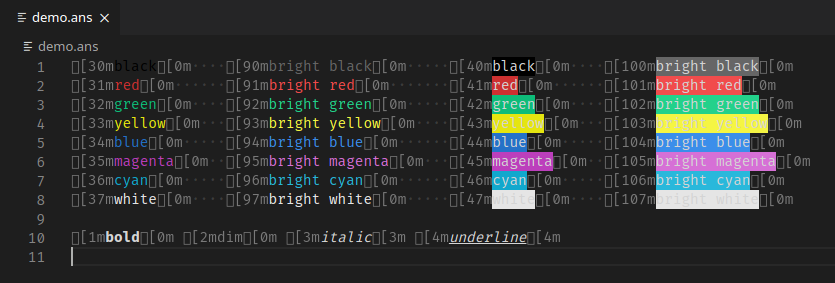
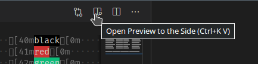
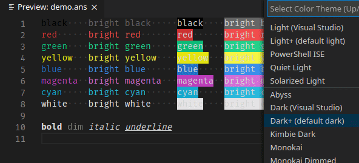
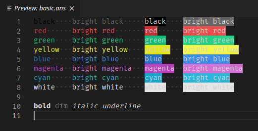
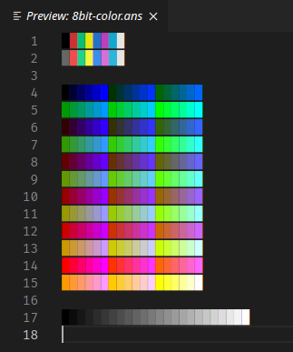
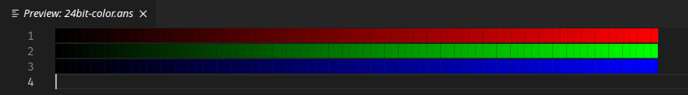

[](https://marketplace.visualstudio.com/items?itemName=iliazeus.vscode-ansi)
[](https://github.com/iliazeus/vscode-ansi)
[](LICENSE)
[](https://github.com/iliazeus/vscode-ansi/issues)
[](https://github.com/iliazeus/vscode-ansi/issues?q=is%3Aissue+is%3Aclosed)

# ANSI Colors

ANSI Color styling for your text editor.

## Basic usage

Select the `ANSI Text` language mode to highlight text marked up with ANSI escapes. Files with the `.ans` and `.ansi` extensions will be highlighted by default.



Run the `ANSI Text: Open Preview` command for the prettified read-only preview.


Clicking the preview icon in the editor title will open the preview in a new tab. `Alt`-click to open in the current tab.



The extension fetches the colors from the current theme and aims to look as good as the built-in terminal.



## Supported ANSI escape codes

Basic colors and formatting:



8-bit colors:



24-bit colors:



## Custom file icon

You can add an icon to the ANSI text files by using the [`vscode-icons`] extension:

```javascript
{
  // add this to your settings file
  "vsicons.associations.files": [
    {
      "icon": "text", // or any other icon from vscode-icons
      "extensions": ["ans", "ansi"],
      "format": "svg"
    }
  ]
}
```

[`vscode-icons`]: https://marketplace.visualstudio.com/items?itemName=vscode-icons-team.vscode-icons
