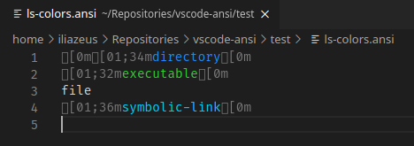
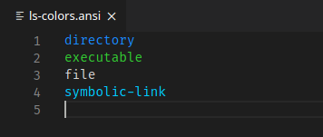

# ANSI Colors

ANSI Color styling for your text editor.

Select the `ANSI Text` language mode to highlight text marked up with ANSI escapes.

Or run the `Show as ANSI` command for the prettified read-only preview.

